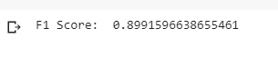

# MSDS18022_COVID19_DLSpring2020
This repository contains code and results for COVID-19 classification assignment by Deep Learning Spring 2020 course offered at Information Technology University, Lahore, Pakistan. This assignment is only for learning purposes and is not intended to be used for clinical purposes.

Attached notebook contains two type of experiments one with freezing all layers of VGG16 adn ResNet18 and adding new FC layers by removing already added ones, second type is to train networks by unfreezing some CNN layers and finally doing a critical analysis of unfreezing all CNN layers of both already trained models by retraining it.

## VGG16 and ResNet18 with FC layers training

### ResNet-18

#### Experiment 1:
Learning Rate = 0.0001, Epochs = 5, Batch Size = 8, Momentum = 0.9

Best Images: with true labels

Worse Images: with true labels

#### Experiment 2:
Learning Rate = 0.01, Epochs = 5, Batch Size = 8, Momentum = 0.95

### VGG-16

#### Experiment 1:
Learning Rate = 0.001, Epochs = 3, Batch Size = 60, Momentum = 0.9

Best Images: with true labels

Worse Images: with true labels

#### Experiment 2:
Learning Rate = 0.01, Epochs = 5, Batch Size = 8, Momentum = 0.95

### Critical Analysis
Training on full data set, In my experiments VGG was performing better although it was taking a little higher time to learn. While learning I noticed that decreasing batch size was increasing accuracy. I was able to get highest accuracy in case of VGG16 as 87% and in case of ResNet18 it was 84%. 

I noticed that by increasing the batch size to 60 incase of ResNet was drastically decreases the performance, I joined the same number of FC layers in the end, but I don’t why this happened. For both the experiments I used learning rate 0.001 and I tried 0.0001 but I didn’t get good results with that. Moreover, I set momentum to 0.9 or 0.95. 

## VGG16 and ResNet18 with all CNN layers training

### ResNet18

#### Experiment 1:
Learning Rate = 0.0001, Epochs = 5, Batch Size = 8, Momentum = 0.95 with Last layer unfreeze

### CNN16
Learning Rate = 0.001, Epochs = 5, Batch Size = 8, Momentum = 0.95 with Last CNN layer unfreeze

### Critical Analysis
Training on full data set, If we compare 3 epochs of Full VGG network, it has highest F1 score, although accuracy remains the same to 87% which we received in FC layer. So, again, by more epochs this score can increase to near 90% or go beyond that.

ResNet-18 with Full unfreeze layers outperforms VGG as with 3 epochs it gives 88% accuracy with 1 F1 score. 

Dataset Link: https://drive.google.com/file/d/1-HQQciKYfwAO3oH7ci6zhg45DduvkpnK/view

You can find trained models in trained models folder:

  1. vgg16_FC_Only.pth
  2. res18_FC_Only.pth
  3. vgg16_entire.pth
  4. res18_entire.pth
